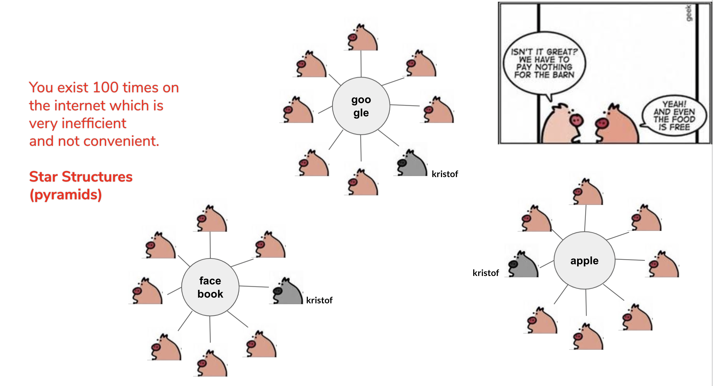
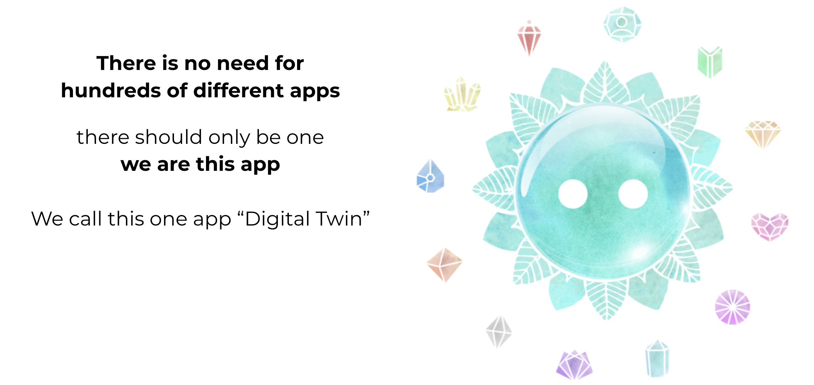

# Energy Savings Digital Twin

In this document we walk you through how much more efficient a digital twin is in relation to power utilization compared to the alternative in the world today.

## The high level problem

In today's world we exist more than 100x times and this is super inneficient. 

For each use case (e.g. facebook, amazon, gmail, ...) we exist in a huge system with databases and compute front ends. Google for their mail and office allone has millions of servers.

## Only 1 digital twin required.

To run your digital life you only need 1 digital twin to be alife in stead of 100x different client-server systems.

Each digital twin is highly efficient to process your digital life.

All these digital_twin's talk to each other in a peer2peer way leading to very efficient organic system.

## why can we be so efficient compared to a centralized system

Typically we can host more than 100 users on a small host (computer) of less than 2000 eur.

We have to ask ourselves, how much active data are we working with on any point in time?

We believe this is not more than 100 MB of data.

Bigger files (video/audio) are streamed to the backend but you don't use them all the time and if you do they are very easy to cache e.g. a video of 1 GB takes about 1 hour to watch it.

The other content are messages, structural data, ... this easily fits in 100 MB of memory.

This means a digital twin can keep most data in memory which you use at that time which means the twin does not need to go to the backend that much saving amazing amount of energy.

By keeping more things in memory the following advantages apply

- a lot less context switches: avoid_context_switches
- no stress on backend storage system
- no SSD access required

# upto 100x less networking required.

Today in our digital life we have to go to centralized locations for most of what we do.

If 2 people in a village in Africa send a message to each other, the message is first going to centralized datacenter e.g. in United States where it will go to another location in the world, before it goes back to the destination person who fetches it through their (web) based email client.

This is super inefficient.

- the message travels many thousands of km (in stead of 2 km)
- the message needs to go over 2 centralized mail systems (sometimes over multiple hops)
- the message gets storage in large databases (2x)

This is not needed, with a digital twin the sender talks to his twin which is close to him, that twin will find the other twin to send the message directly. The twin's are probably close to each other because the sender and receiver twin are in the same city. This leads to a much more efficient way how to deal with data transport.

Networking uses a lot of power in the world (see graph below), thanks to our approach we can also safe here a lot of energy.

!!!include:effect_cooling

## avoiding context switches

In client server systems, there are many software layers.
Today in the world everything is a client server system.

Database layers, software defined networking, storage and network virtualization, hypervisors, process managers, ...

Each of these layers have to do lots of context switches.

Context switches are the main cause of servers not being used efficiently.

A context switch is needed when the CPU needs to switch out memory so it can process something for a specific process. Whenever another process needs time, the memory required for tht process needs to be transfered into the CPU. 

On busy servers the amount of context swithing is huge, the more layers the more context switching.

We have seen server systems which are only usable for less than 20% of their real capacity compared to pre-emptive multi tasking.

Thanks to the design of a digital twin a lot of these context switches are avoided leading to a much more efficient system.

## Usage of a fast development language.

The Digital Twin is compiled to C. C is a very fast language and allows us to be efficient in utilization of the hardware resources.

## Digital Twin Uses Our Quantum Safe Storage System

See qsss. 

The cost for storage in our design is super low see [energy_savings_storage](energy_savings_storage).

Thanks to this design every twin can store data over multiple nodes in all security but yet under full control and saving lots of energy, see that [doc](energy_savings_storage).

## Many more tricks.

There are many more tricks and we will be able to do even much more in the future.

e.g.

- pre-emptive multitasking for all actions: avoiding more context switching
- do more of the low level algoritms in e.g. FPGA cpu's
- liquid cooling

## Calculation

## What would this do for the world?

Its hard to compare this with existing systems but lets do a mental excercise if all users would be on this system.

To power 4Billion people with a system like ours we need less that 10 giga watt of power.

Note

- gaming & virtual reality usecases are not included in above use cases
- we only compare with 20% of the total (see calc)
- network is also out (in comparison as well as market nr)

This shows how a digital twin can be very power efficient way how to deliver a deliver a green digital life to everyone.

Potential power savings are 40.000 times for datacenters allone.

## How else can we save power.

- network: at least 10x because of just needed a lot of less bandwidth
- production of IT: 10-100x
- consumer devices: probably not much
- datacenters: huge, for sure +100 times if we consider all workloads

Conclusion we can for sure save between 10 and 100 times on global power requirements for our digital life, we believe this is huge and worth it.

!!!include:energy_savings_toc