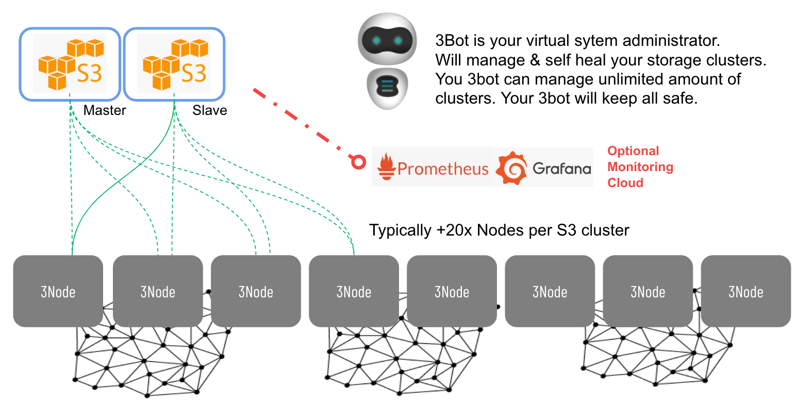
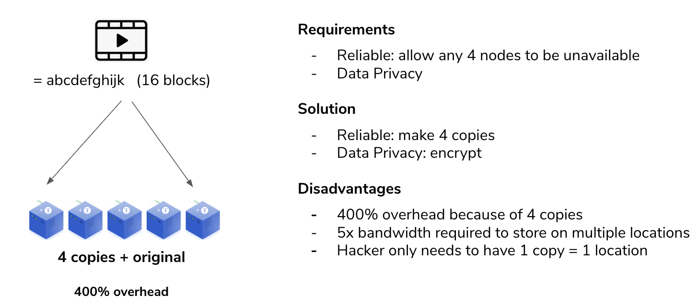
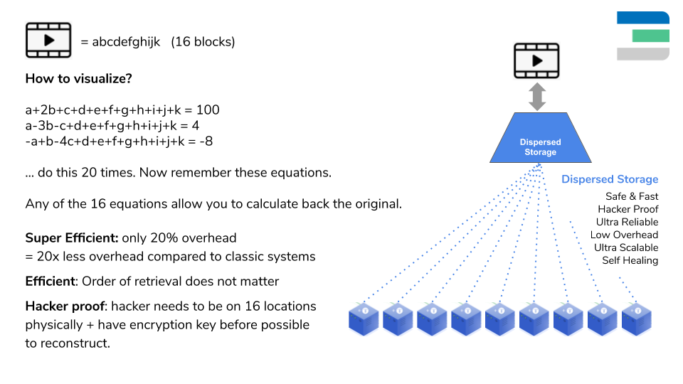

# Hercules Storage

## What is Hercules Storage?

Hercules storage is decentralized and distributed private storage environments at the edge or in core data centers in full scale-out mode. There is no scale limit to this storage platform. The external interface is an S3 interface but developers can also use the more lower level interface.

#### 3-tier architecture

- the *front end* of the storage system represent the S3 interface (protocol) to applications to store data objects.  
- the *middle layer* is called 0-store and accepts the input from the front end. This layer is driven by a "storage policy" which configures the  efficiency, redundancy and performance characteristics of the storage solution and can be configured to meet any combination of those characteristics. A unique storage distribution mechanism is being used to provide better redundancy at +3x less overhead.
- the backend of the storage system is a very efficient "storage" database (0-db) that manages (a slice) physical storage devices and exposes an API to that disk on the network. 

This approach, a decentralized and distributed storage architecture allows for the storage architect to:
- Choose where to run the front end storage interface
- Choose where to run and process the execution of the the storage policy and encryption
- Choose where to store the data (location of the 0-db's)

To maximize performance, all of the components can be run in close proximity of well connected 3nodes (to maximize throughput and minimize latency).  To maximize reliability a wider spread on used 3nodes will counter natural disasters and other failure modes.  The storage policy creates 100% flexibility to design and optimize the required performance, reliability and redundancy.

## Features

*   Simple Storage Service (S3) compatible
*   Full integration with zero-os overlay networking layer (efficient and encrypted network)
*   Supports deployments at the edge or in large scale datacenters (optimize performance and/or reliability)
*   Integrated with a scalable & capable monitoring system (Prometheus based), deployed by default
*   Can be integrated with our advanced billing/chargeback mechanism

## Architecture

### Unlimited Scalability

The system is a pure scale-out storage system, it can scale to unlimited size, there is simply no bottleneck inside this system. Each S3 system is independent and uses our ThreeFold Space Codec to store the data distributed over typically 20 3nodes. Only 20% overhead is required to come to reliability which allows losing any 4 nodes at the same time per S3 storage system (this can easily be changed to even more redundancy).

### Private (not multi-tenant)

Each architecture on the TF Grid has its own private overlay [network](hercules_network) which makes the storage solution a single tenant solution by design.  On top of that, each S3 deployment has 1 master and (optional) 1 slave S3 front end server which can be operated in a private setting when there is no Web Gateway used to connect it to the public internet, or the S3 interface can be exposed on the public internet by using the [Web Gateway](hercules_network).

To deploy and manage an S3 cluster the enduser uses their 3bot (or a child of their 3bot) to manage the S3 instance (cluster). All required encryption keys and storage policies are managed by the private 3bot. It is a complete private and this single tenant solution. For good reliability and performance of the S3 instance we recommend to use a storage policy that includes at least 20 3nodes (disks) per S3 cluster.  A well defined storage policy leads to good performance, excellent reliability and low overhead.  A much used policy is 16+4 where the original object is represented by 16 equations derived from the original data object and then 4 more equtions are created for redundancy purposes.  This creates 20% overhead (4 out of 20) but delivers a solution that can sustain failure of 4 simultaneous disks (or in the case that 20 3nodes are used a failure or 4 simultaneous 3nodes) without loosing access to the original data.

One very important fact to mention is that this way of storing data eliminates the need for all original data objects to be retreived in order to get the original objects back.  *Any* 16 of the total of 20 equations stored will allow for the original data object to be retrieved.  Whichever 16 equations arrive first at the S3 cluster allow the original data object to be recreated. 
Prometheus and Grafana monitoring is optional and can be enabled.

This design leads to ultimate security, privacy, performance, scale and flexibility to design specific storage solutions.

### 100% Self Healing Possibility (v2.1)

In v2.1 we have added 100% self healing capability which means that any automation software can interact and e.g. failover when required between master & slave front ends. 

## Storage Efficiency

### Legacy Storage World

Data gets copied 5 times if you want to be able to lose 4 copies of your data, this is not efficient.

Security provided by encryption.

### ThreeFold Space Algorithm

The ThreeFold approach leads to 20x less overhead compared to the traditional storage system.

It's also a much more safe system.

## Main Benefits

### Reliable / Secure

*   [Hercules Space Algorithm](hercules_space_algo)): 
    *   only 20% overhead for the ability to lose any 4 location/nodes
    *   hacker needs to hack 20 locations at once, need to know encryption keys & space algorithm
*   [Hercules Protect](hercules_protect): 
    *   no hacking surface to the Zero-Nodes, integrate silicon route of trust
*   Hercules Network: 
    *   encrypted overlay network connects the storage to users when required
*   [Hercules Filesystem](hercules_filesystem): 
    *   dedupe, zero-install, hacker proof deployment of all required components
*   [Hercules Web Gateway](hercules_web_gateway): 
    *   the intelligent connection between web (internet) and storage services
*   Hercules Audit (oem): on request, all file changes audited in blockchain
*   [Hercules Compliance](hercules_compliance) (oem): on request, ultra-strong compliance can be proven location, write once - read many time, remove data, privacy, …)

!!!include:hercules_usp_sustainable
!!!include:hercules_usp_manageable
!!!include:hercules_usp_scalable
!!!include:hercules_usp_reliable_secure

## Roadmap

### v2.1: Active (all features as described above are available)

- done

### OEM release: on request of customers

*   Filemanager Integration (web based)
*   Webdav access
*   Full text indexing capabilities
*   Full auditing & workflow management for file changes.

