# **BE THE INTERNET**: ThreeFold 3.0

## Internet Evolution

### Classic Internet

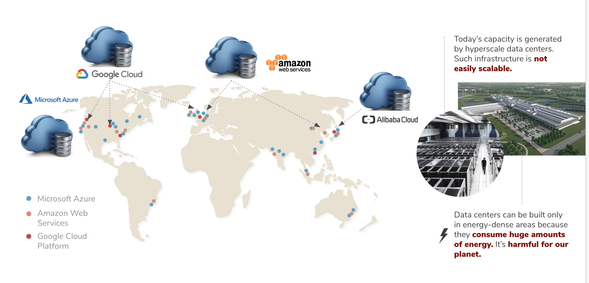

Everything is structured as client server.

- The servers run as applications inside these big datacenters using a lot of energy.
- Lots of the processes in those servers are being repeated = not efficient.
- we exist 100x times, super non efficient.
- This leads to lot of centralization -> insecure and abuse of our data.

### Blockchain Based 

Blockchain decentralized the server, but in principle its still client - server.

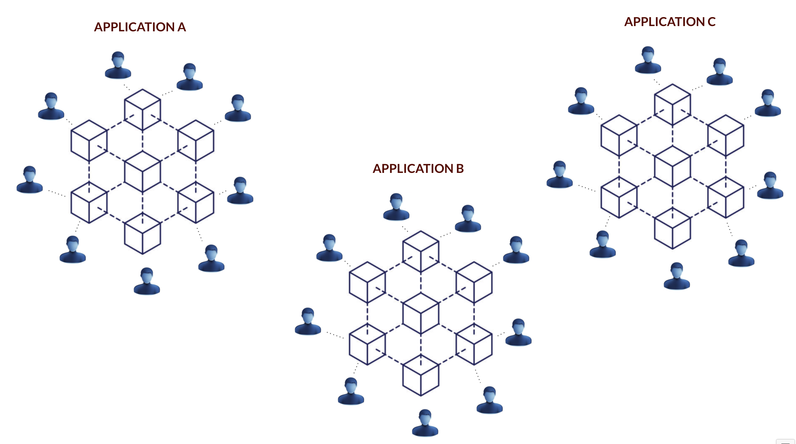

- Its definately a step in the right direction but the paradigm is the same.
- We as users still exist in different systems and have to deal with different applications (protocols).
- These blockchains can be integrated and through web 2.0 concepts the web application can interact with multiple blockchains at the same time.

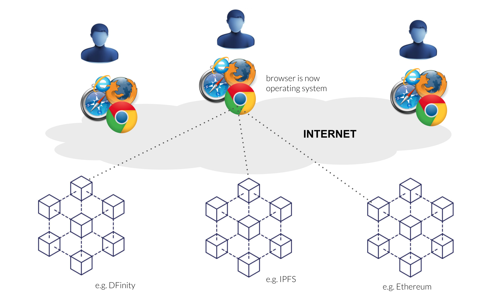

The browser now became our operating system running on javascript. All applications run in our browser and interact with multiple blockchains.

This shows how actually nothing really got changed, the paradigm is the same. The server got distributed out using different mechanism which can be co-owned by more people and be linked to a better consensus paradigm (which often is not the case).

#### some issues with this approach

- Today there are more than 100x different blockchain based projects
- NOT GREEN: lotsof duplication of effort and many blockchains are not even green.
- Not private lots of data is public available on these blockchains, only encryption can bring some relief.
- Slow, stitching protocol driven backends (blockchain) together in a browser is inherintly slow.
- Not secure, hackers operate at the browser level, the operating system came on other level.
- Complicated for the developers, new languages and ways how to do everything.

### DFINITY The Internet Computer

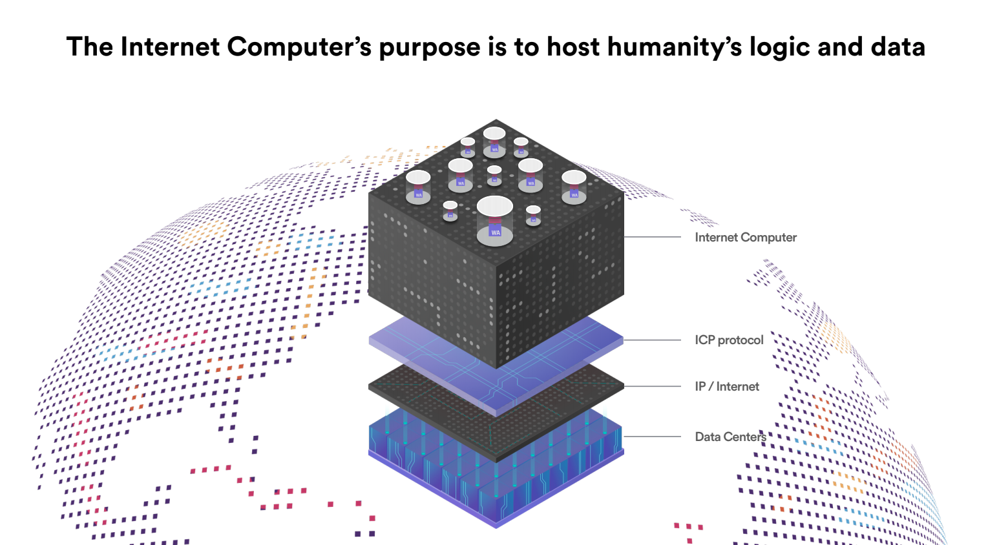

A massive distributed server with more capabilities. Is still blockchain based and has same issues as above, but is definately a very advanced iteration.

Protocol driven security based on encryption and blockchain technology.

It still client server where we (the user) are part of a big machine.

#### Advantages

- New paradigm can be made very scalable & reliable
- Maybe (eventually) more easy than having to code all from scratch, more primitive constructs available.
- The language they use and how they get to redundancy is very cool.
- They have a lot of money, they should be able to create awareness.

#### Disadvantages

- Slow, they are talking ms to get info, seconds for updating data.
- Limited in features, it will take long time to change everything and cost massive amount of investment to get everyone to change their programming habits.
- No good storage paradigms, potentially needs other blockchain technologies to complement leading to performance loss and more complexity.
- Protocol driven architectures lead to less security, hackers have more visibility than a true peer2peer system with no blockchain.
- A huge big distributed machine, delivered by many commercial parties can lead to less than optimal decentralization.

## The ThreeFold Vision

- you in the center of your digital life
- blockchain only needed for specific functions (money, identity, smart contracts, ...)
- internet 10x more efficient
- data sovereignity for all
- an internet created by all for all = **be the internet**

### From Client Server to Peer2Peer

Peer2peer is much more decentralized as client server.

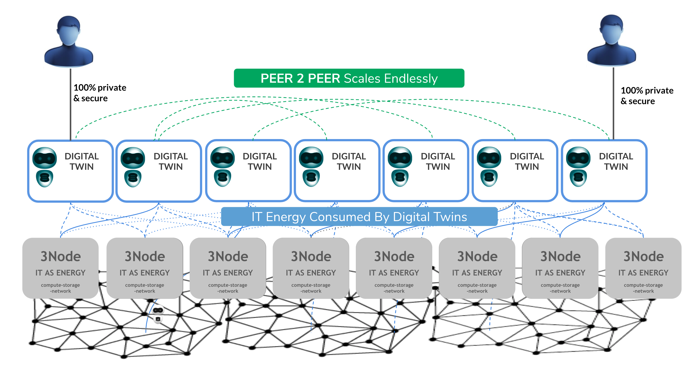

- each user has 1 digital twin
- this win serves your complete digital life
- the digital twin represents you and has all logic required to act on your behalf.
- all digital twins talk to each other over private secure links
- there is no blockchain involved for the compute, storage & network requirements.
- each digital twin needs compute, network and storage resources to survive, the twin will use TFT to reserve and pay for these resources as used on the ThreeFold Grid.
- The twin is the only entity who has control over the resource it requires, its all 100% private and no blockchain involved to reserve and use that capacity.

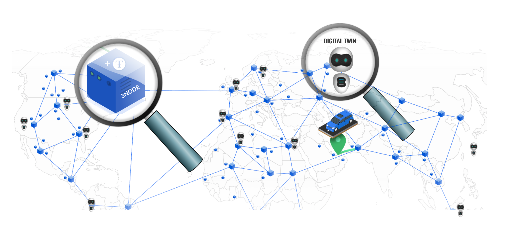

- There can be unlimited amounts of 3Nodes as well as Digital Twins.
- There are not bottlenecks or centralization points.
- Our peer2peer network technology takes care of routing and security issues between the Twins and the 3Nodes. The shortest paths is always looked for.

### The Digital Twin Provides your digital life.

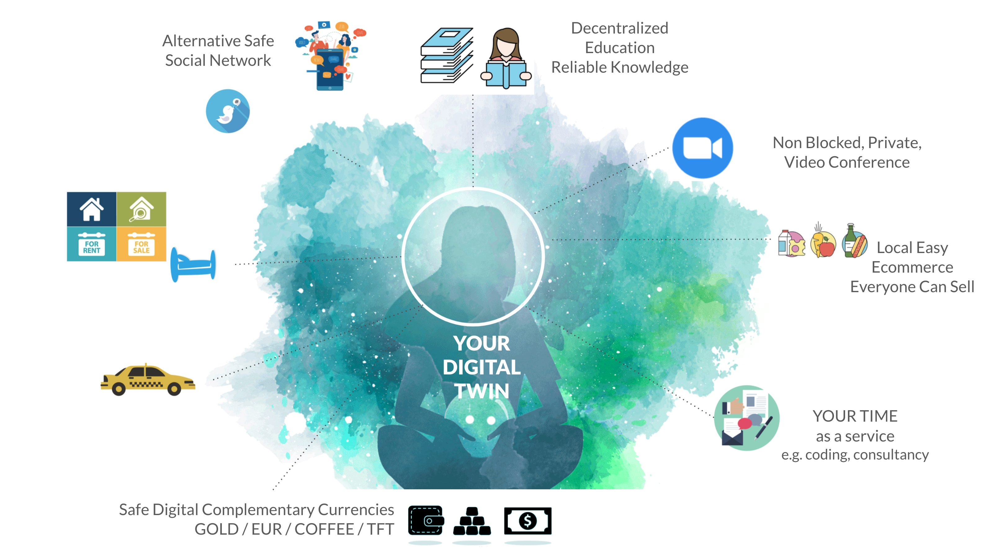

- full control over your own digital life.
- experiences to be created using standard web technologies (html, javascript).
- the digital twin delivers the web interface to your (secure) browser.

- no need for information to travel to central datancenters, all communication is fast and private between digital twins. No more client-server.
- all logic of your digital life is 100% private to you running in your twin.
- a secure browser engine makes sure that rendering and javascript execution happens in secure context, give hackers no chance (optional)
- this is super efficient and sustainable, +10x power savings.
- no blockchain required for your digital life = more privacy, performance, green
  - expception: blockchain is needed for digital currencies and as phonebook for digital twins identity.

### The ThreeFold Grid Provides the IT energy

Each 3Node is an IT Power generator. The TFGrid is the network of these 3Nodes.

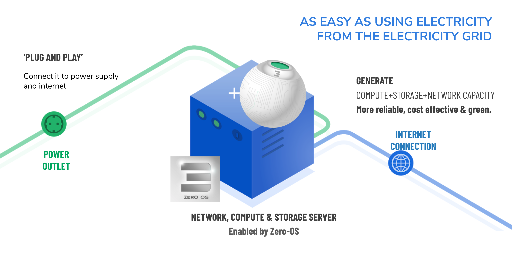

Needs to be super simple, just like how a solar panel generates electricity.

- The 3nodes do for internet what solar panels do for large scale electricity power plants.
- They allow everyone to contribute to a new internet.
- People investing in the 3nodes are called [farmers](farming_home).
- Each farmer receives tokens called TFT for providing this IT capacity.
- IT Capacity is storage, compute and network capacity for this upgraded internet.
- The Twin's need TFT to pay for the IT capacity they need.

### Unique storage architecture for the digital Twin.

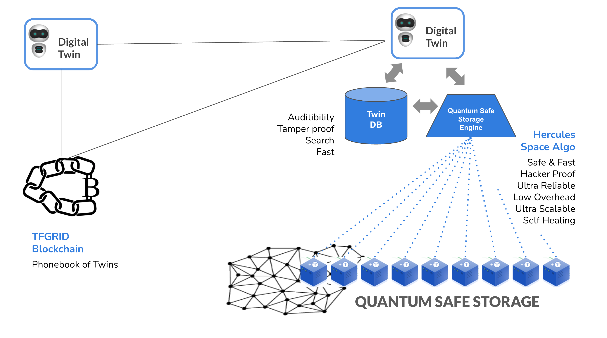

- using our qsss
- Not based on replication or blockchain!
- your data is spread over the TFGrid in such a way that not even a quantum computer can hack it. 
- The data is 100% owned by you and zero-knowledge proof to the the TFGrid.

### ThreeFold learned from Nature

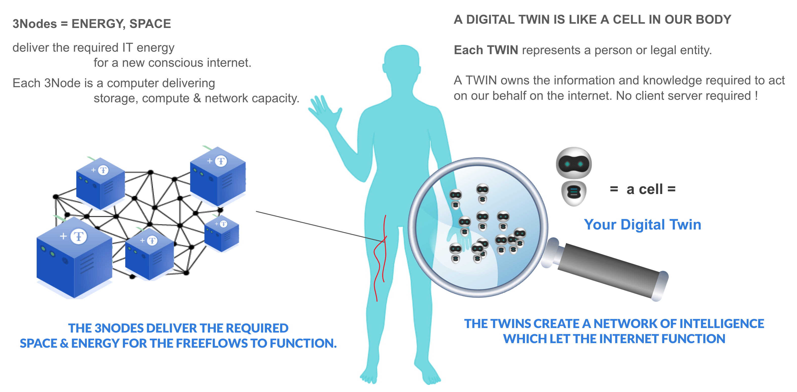

- Just like we have trillions off cells in our body, so can billions of twins live next to each other.
- Each twin has memory, knows how to communicate, has knowledge, history, ...
- Twins like cells cannot live without a body = TFGrid.

### ThreeFold is compatible with current IT world.

We do realize that making our current vision reality will take some time.

That is why we have made our infrastructure compatible with the exiting IT and internet ecosystem.

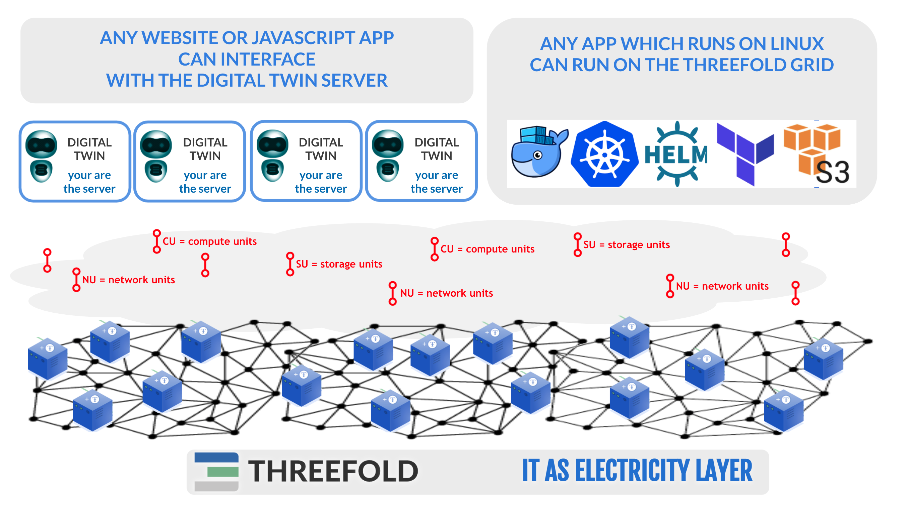

- any workload which can run inside linux can run on top of our TFGrid.
- any web developer can create apps (experiences) on top of the Digital Twin.
- just like kwatth is used as a measurement of capacity for solar panels we have [CU](cloud_units), [SU](cloud_units) and [NU](cloud_units).
- TFT is required to buy CU,SU,NU.

## ThreeFold in a nutshell

### Values

- equality = equal chances for everyone
- Data Sovereignity = we own our data, and all data in our country
- Sustainability = orders of magnitude more green.

### Roadmap

- 2018: token launched & blockchain
- 2019: Grid v1.0 launched
- 2020: Grid v2.0 launched
- 2021 Q2: token gets more exposure
- 2021 Q3: [fundraise 40m EUR](https://info.threefold.io/info/funding#/)
- 2021 Q3: lots of partners start using TFGrid
- 2021 Q3: larger token (re)launch (TBC)
- 2021 H2: Grid v3.0 
- 2021 H2: Digital Twin v1.0 in beta
