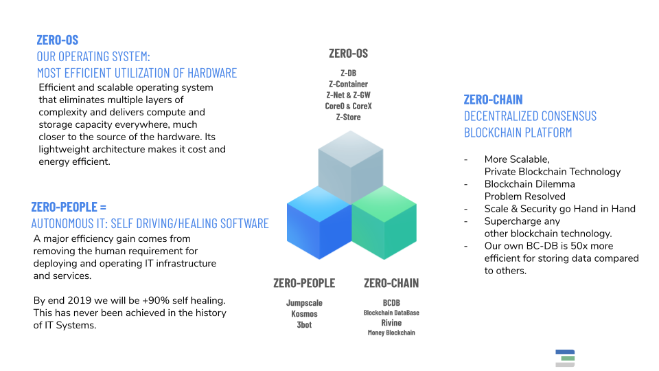

## Technical Components

<!-- tabs:start -->

### **Zero-OS**

Zero-OS is a minimal operating system serving one single purpose: to make the hardware available to the autonomous layer. Zero-OS is a stateless operating system and is not installed on a storage device in the server. At boot time, the needed binaries and config files are made available over a secure network connection. The zero-footprint locally on the server simplifies administration work needed for these servers, enabling these servers to live anywhere.

In Zero-OS, the number of active components and therefore the complexity of the operating system has been brought down to the absolute minimum, making maximum execution capacity available to real-world use cases and applications.

Read more about the Zero-OS in [our capacity white paper](capacity_layer)

### 3Bot = Your Virtual System Administrator

Read more about the 3Bot in [our autonomous white paper](autonomous_layer).

### Jumpscale

**Jumpscale-ng**: The automation platform which makes the 3Bot possible

Jumpscale is an automation framework written in Python . It has been developed for more than a decade and originates from an automation product which was acquired by SUN Microsystems from Q-Layer, which was one of our previous companies. Our newest release is version 10, called JSX.
Jumpscale is the foundation for the autonomous layer. To get to autonomous operations, IT experts have to model IT architectures. These models have to describe all the components involved in creating the architecture (e.g. a container running a webserver, a container running a database server, and then all the required network paths between these two containers and the rest of the world). Once this description is complete and tested, it can be given to the autonomous layer which launches, monitors, and operates the architecture. Hence, autonomous IT.

### BCDB

**BCDB** = A Beyond Blockchain Database
This is a database (scalable, secure, etc.) incorporating all the features of modern blockchain technology.

The blockchain database (BCDB) is a super-efficient database that uses blockchain technology to securely store and retrieve data. Blockchain principles like "always append" and “store data in an immutable manner” are key aspects of this database technology.

The blockchain database is used in the autonomous layer for storing information of users, farmers, the digital representatives (3Bots), IT Architecture descriptions, and the state information of these running applications. This database technology provides distributed storage of key information of the autonomous layer.

For a 100 node deployment, our BCDB will be **50x more efficient **compared to other blockchain technologies for storing data from a storage and network perspective.

The BCDB is used in the 3Bot which means every user has his or her own Blockchain DataBase. A BCDB can also be used as a shared ledger between multiple people.

This technology component alone is significant enough to grow a big startup business on its own. Read more about the BCDB in [our autonomous white paper](autonomous_layer).

### Zero-Store

The Zero-Store technology contains all the logic to store data in a reliable and effective manner over multiple devices in multiple geo-locations. Embedded in the software are basic storage primitives to process data before sending it to distributed devices, which are aimed at increasing the performance of searching, finding data, and securing data.

- **Chunking:** makes large datasets indexed and cut into smaller organized data chunks, improving access and search speed.
- **Compression:** makes data storage use less physical storage by passing it through an algorithm that compresses the data volume.
- **Encryption:** creates unreadable data for the people or processes that do not have the (proper) key to decipher the information.
- **Disperse:** storage in such a way that data becomes 100% secure and cannot be retrieved from one site alone. It also allows you to retrieve your data when some of the storage nodes are offline.

All of these primitives are configurable and you can decide how data will be processed (optimized) before being sent to the distributed storage devices → the zero-databases. This makes dispersed storage a very reliable and performant storage solution without compromising effective use of physical storage capacity.

Read more about our storage system in [our autonomous white paper](autonomous_layer).

### Zero-DB

A optimized storage technology which uses physical storage media like SSD or HDD. The technology has dedicated management processes per physical storage device, ensuring optimized usage parameters to maximize performance.

Zero-DB technology is characterized by the following aspects:

- Backend Storage Engine
- Can do +50.000 transactions per/sec
- Can work on SSD & HD
- Optimized for easy (soft/green) operation on HD
- Works with reservations
- Always append store
- Can keep unlimited history
- Primary / Secondary replication

### CORE-0 and CORE-X

**Core-0**

We call Core-0 the combination of all the low level components of Zero-OS. Each component is responsible for a part of the logic handled by Zero-OS when exposing the hardware capacity (storage, compute, and network) to the higher layers.

**Core-X**

Is the process manager for an individual container. Because of the secure nature of the 3Nodes, a direct connection from a user to a node is not possible, but Core-X allow users to connect to their own containers and manage the processes inside. It has a web interface as well as a REST interface. So, the containers can be managed both manually and programatically.

<!-- tabs:end -->

### Stellar

**Stellar** ThreeFold Uses the Stellar Blockchain for issuance of the ThreeFold_Token(TFT).
Stellar's values match very well with ThreeFold's values, and their technology is proven and had a huge community backing it.

## Integrated Technology

The 3-layer technology stack provides a very flexible, efficient, and powerful setup to create and run many different IT workloads. The components are available to be used in specific setups, creating a large number of actual use cases.

The capacity, autonomous, and distributed application layers are created by combining and integrating all of these technology components.

